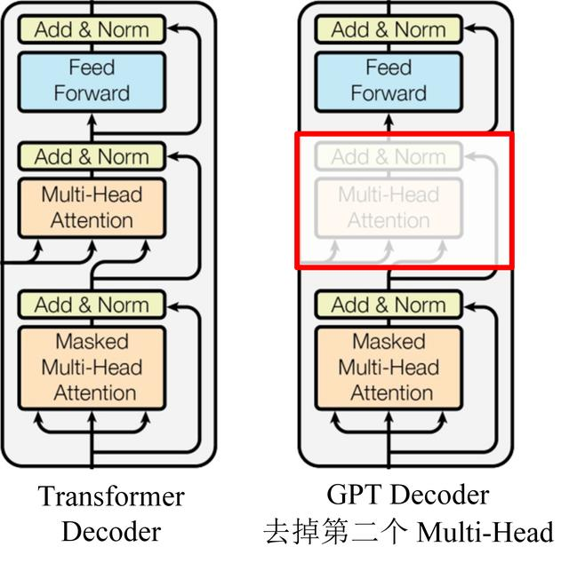

# OpenAI GPT 和 GPT2 模型详解

OpenAI GPT 是在 Google BERT 算法之前提出的，与 BERT 最大的区别在于，GPT 采用了传统的语言模型进行训练，即使用单词的上文预测单词，而 BERT 是同时使用上文和下文预测单词。因此，GPT 更擅长处理自然语言生成任务 (NLG)，而 BERT 更擅长处理自然语言理解任务 (NLU)。

**1. OpenAI GPT**

OpenAI 在论文《Improving Language Understanding by Generative Pre-Training》中提出了 GPT 模型，后面又在论文《Language Models are Unsupervised Multitask Learners》提出了 GPT2 模型。GPT2 与 GPT 的模型结构差别不大，但是采用了更大的数据集进行实验。GPT 与 BERT 都采用 Transformer 模型，对 Transformer 和 BERT 不熟悉的童鞋可以参考之前的文章Transformer 模型详解和彻底理解 Google BERT 模型。

GPT 采用的训练方法分为两步，第一步利用没有标签的文本数据集训练语言模型，第二步是根据具体的下游任务，例如 QA，文本分类等对模型进行微调，BERT 也延用了这一训练方法。我们首先了解一下GPT 与 BERT 的主要区别。

**预训练：**GPT 预训练的方式和传统的语言模型一样，通过上文，预测下一个单词；GPT 预训练的方式是使用 Mask LM，可以同时通过上文和下文预测单词。例如给定一个句子 [u1, u2, ..., un]，GPT 在预测单词 ui 的时候只会利用 [u1, u2, ..., u(i-1)] 的信息，而 BERT 会同时利用 [u1, u2, ..., u(i-1), u(i+1), ..., un] 的信息。如下图所示。

BERT, GPT 和 ELMo 模型的区别

**模型效果：**GPT 因为采用了传统语言模型所以更加适合用于自然语言生成类的任务 (NLG)，因为这些任务通常是根据当前信息生成下一刻的信息。而 BERT 更适合用于自然语言理解任务 (NLU)。

**模型结构：**GPT 采用了 Transformer 的 Decoder，而 BERT 采用了 Transformer 的 Encoder。GPT 使用 Decoder 中的 Mask Multi-Head Attention 结构，在使用 [u1, u2, ..., u(i-1)] 预测单词 ui 的时候，会将 ui 之后的单词 Mask 掉。

**2. GPT 模型结构**

GPT 使用 Transformer 的 Decoder 结构，并对 Transformer Decoder 进行了一些改动，原本的 Decoder 包含了两个 Multi-Head Attention 结构，GPT 只保留了 Mask Multi-Head Attention，如下图所示。

GPT 的 Decoder

GPT 使用句子序列预测下一个单词，因此要采用 Mask Multi-Head Attention 对单词的下文遮挡，防止信息泄露。例如给定一个句子包含4个单词 [A, B, C, D]，GPT 需要利用 A 预测 B，利用 [A, B] 预测 C，利用 [A, B, C] 预测 D。则预测 B 的时候，需要将 [B, C, D] Mask 起来。

Mask 操作是在 Self-Attention 进行 Softmax 之前进行的，具体做法是将要 Mask 的位置用一个无穷小的数替换 -inf，然后再 Softmax，如下图所示。

Softmax 之前需要 Mask

GPT Softmax

可以看到，经过 Mask 和 Softmax 之后，当 GPT 根据单词 A 预测单词 B 时，只能使用单词 A 的信息，根据 [A, B] 预测单词 C 时只能使用单词 A, B 的信息。这样就可以防止信息泄露。

下图是 GPT 整体模型图，其中包含了 12 个 Decoder。

GPT 整体结构

**3. GPT 训练过程**

GPT 训练过程分为两个部分，**无监督预训练语言模型**和**有监督的下游任务 fine-tuning**。

**3.1 预训练语言模型**

给定句子 U=[u1, u2, ..., un]，GPT 训练语言模型时需要最大化下面的似然函数。

可以看到 GPT 是一个单向的模型，GPT 的输入用 **h**0 表示，**h**0 的计算公式如下。

**W**p 是单词位置的 Embedding，**W**e 是单词的 Embedding。用 voc 表示词汇表大小，pos 表示最长的句子长度，dim 表示 Embedding 维度，则 **W**p 是一个 pos×dim 的矩阵，**W**e 是一个 voc×dim 的矩阵。

得到输入 **h**0 之后，需要将 **h**0 依次传入 GPT 的所有 Transformer Decoder 里，最终得到 **h**t。

最后得到 **h**t 再预测下个单词的概率。

**3.2 下游任务 fine-tuning**

GPT 经过预训练之后，会针对具体的下游任务对模型进行微调。微调的过程采用的是有监督学习，训练样本包括单词序列 [x1, x2, ..., xm] 和 类标 y。GPT 微调的过程中根据单词序列 [x1, x2, ..., xm] 预测类标 y。

**W**y 表示预测输出时的参数，微调时候需要最大化以下函数。

GPT 在微调的时候也考虑预训练的损失函数，所以最终需要优化的函数为：

**4. GPT 总结**

GPT 预训练时利用上文预测下一个单词，BERT 是根据上下文预测单词，因此在很多 NLU 任务上，GPT 的效果都比 BERT 要差。但是 GPT 更加适合用于文本生成的任务，因为文本生成通常都是基于当前已有的信息，生成下一个单词。

建议阅读一下 huggingface 在 Github 上的代码，里面包含了很多基于 Transformer 的模型，包括 roBERTa 和 ALBERT 等。

**参考文献**

\1. Improving Language Understanding by Generative Pre-Training

\2. Language Models are Unsupervised Multitask Learners

\3. The Illustrated GPT-2